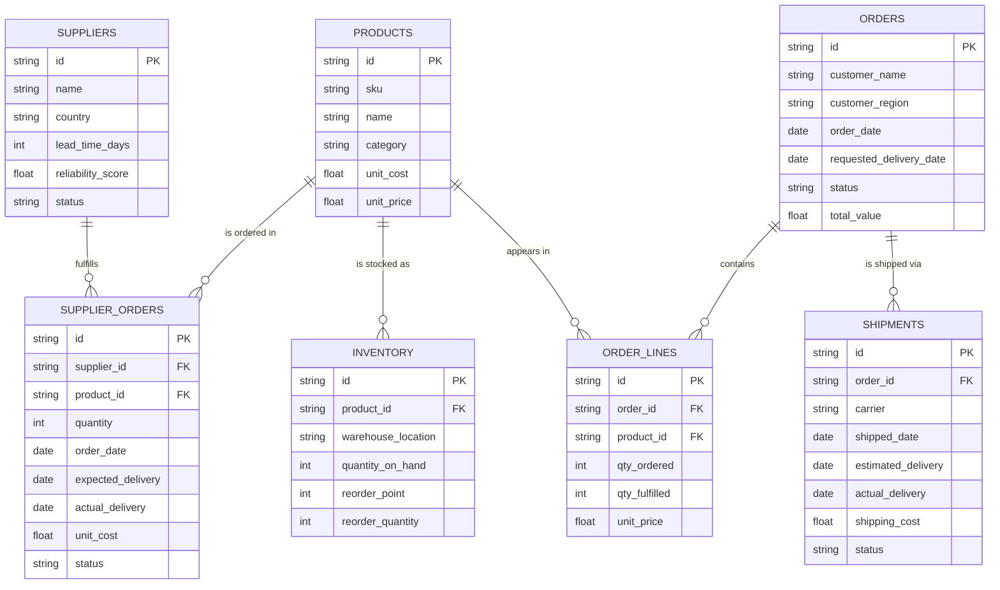

# Logistics Control Tower

> A supply chain KPI dashboard that simulates the operations of a distribution center.

**🔗 Live demo:** _add your deploy URL here (Vercel / Netlify)_

A control tower lets a logistics team monitor the health of a distribution
center at a glance: are orders arriving on time and complete? Is stock
turning over efficiently? Where is money leaking on shipping? This project
recreates that experience as a fast, in-browser dashboard — no backend, no
server, no database process to run.

It is built as a portfolio piece to demonstrate both **supply chain domain
knowledge** (the right KPIs, defined correctly) and the ability to **model
operational data like a real relational system**.

---

## What it does

- **KPI dashboard** — six core supply chain metrics, each with a plain-language
  definition on hover:
  - **OTIF** (On-Time In-Full)
  - **Order Cycle Time**
  - **Fill Rate**
  - **Inventory Turnover**
  - **Stock-out Rate**
  - **Average Shipping Cost**
- **Monthly trend charts** — six months of history per KPI, with the alert
  threshold drawn as a reference line.
- **Configurable alerts** — set a threshold per KPI; cards and a banner
  highlight anything off-target. Thresholds are persisted in the browser.
- **Scenario simulator** — adjust *customer demand*, *shipping cost*, and
  *supplier reliability* and see the estimated impact on every KPI. This is
  classic what-if analysis: _"if a key supplier's reliability drops 15%, what
  happens to OTIF?"_
- **Orders table** — searchable, filterable (status, region) and sortable.

---

## The KPIs, defined

| KPI | Definition | Why it matters |
|-----|------------|----------------|
| **OTIF** | % of orders delivered **on or before** the requested date **and** with 100% of the ordered quantity | The headline service-level metric — a late *or* short order fails OTIF |
| **Order Cycle Time** | Avg days from order placement to actual delivery | Measures end-to-end responsiveness |
| **Fill Rate** | Quantity fulfilled ÷ quantity ordered, across all order lines | Captures partial fulfilment OTIF hides |
| **Inventory Turnover** | Annualized COGS ÷ average inventory value | High = capital isn't trapped in stock |
| **Stock-out Rate** | % of SKUs below their reorder point | Early warning for lost sales |
| **Avg Shipping Cost** | Mean cost per outbound shipment | Tracks logistics spend efficiency |

---

## Data model

The schema is designed as a **proper relational model** so it is portable to a
real Postgres/SQLite backend with no redesign. In the browser it lives in
IndexedDB (via Dexie), but every foreign key is explicit and indexed exactly
as it would be in SQL.



**Design notes**
- `orders` ↔ `order_lines` is a classic header/detail split, so fill rate can
  be computed line by line (an order can be partially fulfilled).
- `shipments` references `orders`, separating *what was promised*
  (`requested_delivery_date` on the order) from *what happened*
  (`actual_delivery` on the shipment) — that gap is exactly what OTIF measures.
- `supplier_orders` (purchase orders) tie back to both `suppliers` and
  `products`, so supplier lead time and reliability feed the scenario model.

---

## Tech stack

Kept deliberately lean — the whole app runs client-side and is light on memory.

| Layer | Choice | Why |
|-------|--------|-----|
| Build | **Vite** | Fast dev server, tiny config |
| UI | **React + TypeScript** | Type-safe components, mirrors the data model |
| Styling | **Tailwind CSS** | No runtime CSS-in-JS overhead |
| Charts | **Recharts** | Declarative, React-native charts |
| Persistence | **Dexie (IndexedDB)** | A relational-style store with no backend process |
| Routing | **React Router** | Real URLs per section |

---

## Architecture

```
src/
├── types/        # All domain types — single source of truth, mirrors the schema
├── db/           # Dexie schema, singleton instance, realistic seed generator
├── lib/          # Pure functions: KPI calculations + scenario impact model
├── hooks/        # Reactive data access (useKPIs, useAlertThresholds)
├── components/   # ui · dashboard · charts · orders · scenario
└── pages/        # DashboardPage · OrdersPage · ScenarioPage
```

KPI logic lives in `src/lib/kpi.ts` as **pure functions** — they take arrays
in and return numbers, with no side effects. That keeps them trivial to test
and independent of where the data is stored, so the same calculations would
work unchanged against a SQL backend.

---

## Running locally

```bash
npm install
npm run dev      # http://localhost:5173
```

On first launch the app seeds ~6 months of realistic data (orders, shipments,
inventory, suppliers, lead times) into IndexedDB. To reset, clear the site's
browser storage.

```bash
npm run build    # production build into dist/
npm run preview  # preview the production build
```

---

## Deploying

The app is fully static, so any static host works. Config is already included:

- **Vercel** — import the repo; `vercel.json` handles SPA routing.
- **Netlify** — import the repo; `netlify.toml` sets the build command and SPA
  fallback.

Both rewrite all routes to `index.html` so React Router's deep links
(`/orders`, `/scenario`) work on refresh.

---

## Possible extensions

- CSV export of the orders table
- Supplier scorecard page (lead time vs. reliability)
- Swap Dexie for a Postgres/SQLite backend using the same schema
