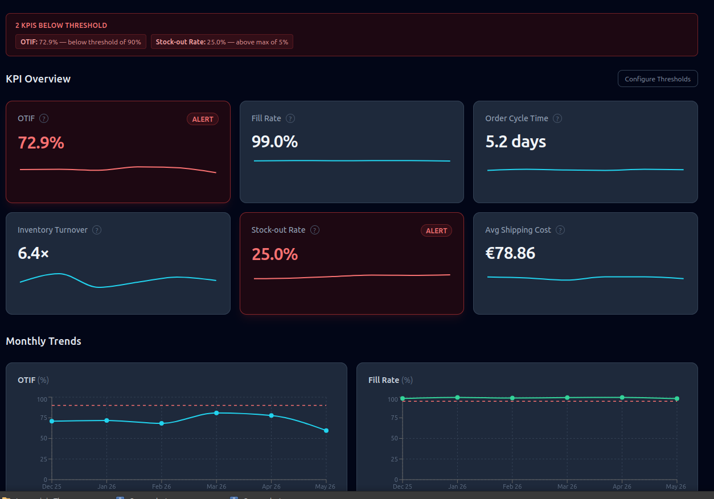
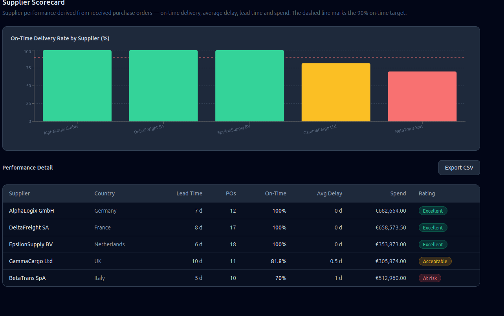
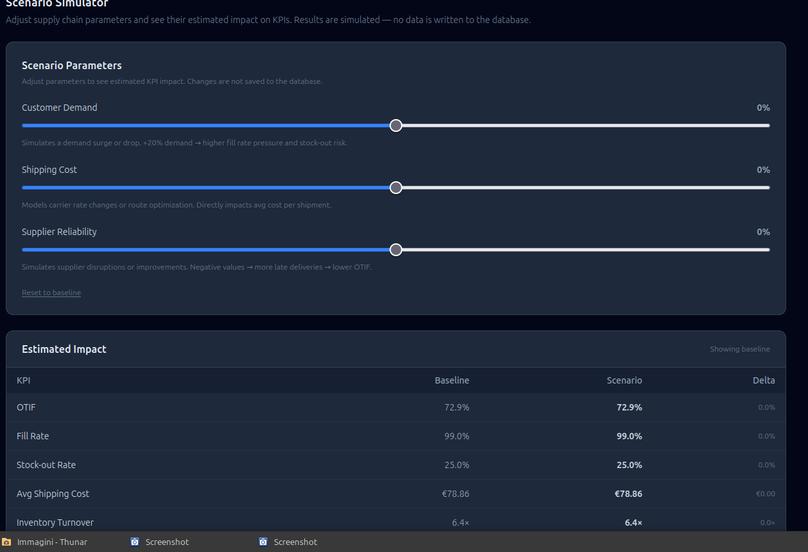
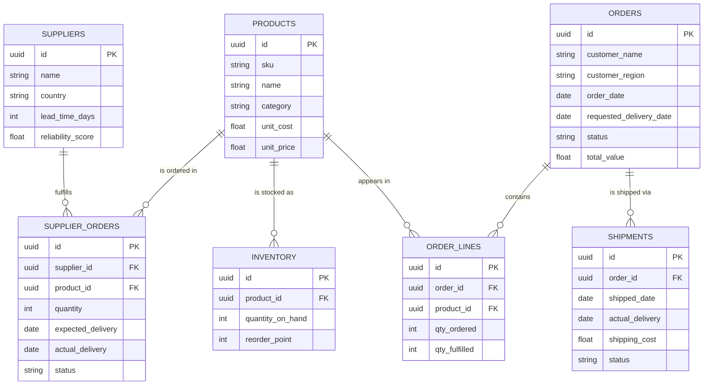

# Logistics Control Tower

> A multi-tenant SaaS supply chain KPI dashboard — built as a portfolio piece to demonstrate logistics domain knowledge and full-stack engineering.

**🔗 Live demo:** https://logistics-control-tower-mu.vercel.app

---

## What it is

A cloud-based control tower for distribution centre operations. Logistics teams use it to monitor service levels, track supplier performance and model operational scenarios in real time.

Every new account gets **six months of realistic seed data** (orders, shipments, inventory, supplier purchase orders) generated automatically at first login — no CSV uploads or manual setup.

---

## Screenshots

### Dashboard — KPIs, alerts and monthly trends


### Supplier scorecard — on-time delivery, delay and spend per supplier


### Scenario simulator — what-if impact on KPIs


---

## Features

### Free plan
- **KPI dashboard** — six core supply chain metrics with monthly trend charts and configurable alert thresholds:
  - **OTIF** (On-Time In-Full)
  - **Order Cycle Time**
  - **Fill Rate**
  - **Inventory Turnover**
  - **Stock-out Rate**
  - **Average Shipping Cost**
- **Orders table** — searchable, filterable by status and region, sortable by date/value

### Pro plan (€9/month)
- **Supplier Scorecard** — on-time rate, average delay, lead time and spend per supplier with bar chart
- **Scenario Simulator** — adjust demand, shipping costs and supplier reliability; see KPI impact instantly
- **CSV export** — orders and supplier data respecting active filters
- **Configurable alert thresholds** — persisted per user in the database

### Platform
- Email/password authentication (Supabase Auth)
- Per-user data isolation via Row Level Security
- Stripe Checkout for upgrades; Stripe Customer Portal for subscription management and cancellation
- Welcome email on registration (Resend)
- Public landing page at `/`

---

## The KPIs, defined

| KPI | Definition | Why it matters |
|-----|------------|----------------|
| **OTIF** | % of orders delivered **on or before** the requested date **and** with 100% of the ordered quantity | The headline service-level metric |
| **Order Cycle Time** | Avg days from order placement to actual delivery | Measures end-to-end responsiveness |
| **Fill Rate** | Quantity fulfilled ÷ quantity ordered, across all order lines | Captures partial fulfilment that OTIF hides |
| **Inventory Turnover** | Annualised COGS ÷ average inventory value | High = capital is not trapped in stock |
| **Stock-out Rate** | % of SKUs below their reorder point | Early warning for lost sales |
| **Avg Shipping Cost** | Mean cost per outbound shipment | Tracks logistics spend efficiency |

---

## Data model

Designed as a proper relational schema — all foreign keys are explicit and every table has RLS policies so each user can only access their own data.


```mermaid
erDiagram
    SUPPLIERS ||--o{ SUPPLIER_ORDERS : "fulfills"
    PRODUCTS  ||--o{ SUPPLIER_ORDERS : "is ordered in"
    PRODUCTS  ||--o{ INVENTORY       : "is stocked as"
    PRODUCTS  ||--o{ ORDER_LINES     : "appears in"
    ORDERS    ||--o{ ORDER_LINES     : "contains"
    ORDERS    ||--o{ SHIPMENTS       : "is shipped via"

    SUPPLIERS {
        uuid   id PK
        string name
        string country
        int    lead_time_days
        float  reliability_score
    }
    PRODUCTS {
        uuid   id PK
        string sku
        string name
        string category
        float  unit_cost
        float  unit_price
    }
    INVENTORY {
        uuid   id PK
        uuid   product_id FK
        int    quantity_on_hand
        int    reorder_point
    }
    ORDERS {
        uuid   id PK
        string customer_name
        string customer_region
        date   order_date
        date   requested_delivery_date
        string status
        float  total_value
    }
    ORDER_LINES {
        uuid   id PK
        uuid   order_id FK
        uuid   product_id FK
        int    qty_ordered
        int    qty_fulfilled
    }
    SHIPMENTS {
        uuid   id PK
        uuid   order_id FK
        date   shipped_date
        date   actual_delivery
        float  shipping_cost
        string status
    }
    SUPPLIER_ORDERS {
        uuid   id PK
        uuid   supplier_id FK
        uuid   product_id FK
        int    quantity
        date   expected_delivery
        date   actual_delivery
        string status
    }
```

---

## Tech stack

| Layer | Choice |
|-------|--------|
| Build | **Vite** + **TypeScript** |
| UI | **React 18** + **Tailwind CSS** |
| Charts | **Recharts** |
| Routing | **React Router v6** |
| Backend | **Supabase** (Postgres + Auth + Edge Functions + RLS) |
| Payments | **Stripe** (Checkout + Customer Portal + Webhooks) |
| Email | **Resend** |
| Deploy | **Vercel** |

---

## Architecture

```
src/
├── types/          # Domain types — single source of truth
├── contexts/       # AuthContext (session, profile, plan)
├── lib/            # Pure functions: KPI calculations, scenario model, data mappers
├── hooks/          # Reactive data access (useKPIs, useSupplierScores, useAlertThresholds)
├── components/     # ui · dashboard · orders
└── pages/          # LandingPage · LoginPage · DashboardPage · OrdersPage
                    # SuppliersPage · ScenarioPage · AccountPage

supabase/
├── migrations/     # Schema, RLS policies, triggers
└── functions/      # create-checkout-session · stripe-webhook
                    # create-portal-session · send-welcome-email
```

KPI logic lives in `src/lib/kpi.ts` as **pure functions** — they take arrays in and return numbers, with no side effects. The same calculations work unchanged regardless of where the data is stored.

---

## Running locally

```bash
# 1. Clone and install
git clone https://github.com/Giuseppe84-code/logistics-control-tower
cd logistics-control-tower
npm install

# 2. Configure environment variables
cp .env.example .env.local
# Fill in VITE_SUPABASE_URL, VITE_SUPABASE_ANON_KEY, VITE_STRIPE_PRICE_ID

# 3. Start dev server
npm run dev      # http://localhost:5173
```

Sign up for a new account — the workspace is seeded automatically on first login.

```bash
npm run build    # production build into dist/
npm run preview  # preview the production build
```

---

## Deploying to Vercel

1. Import the repository on [vercel.com](https://vercel.com)
2. Add environment variables in **Project Settings → Environment Variables**:
   - `VITE_SUPABASE_URL`
   - `VITE_SUPABASE_ANON_KEY`
   - `VITE_STRIPE_PRICE_ID`
3. Deploy — `vercel.json` handles SPA routing automatically

### Required external services

| Service | Purpose | Free tier |
|---------|---------|-----------|
| [Supabase](https://supabase.com) | Database, Auth, Edge Functions | Yes |
| [Stripe](https://stripe.com) | Payments and subscription management | Test mode |
| [Resend](https://resend.com) | Welcome email on registration | Yes |

---

## Supabase setup

Apply the migration in `supabase/migrations/0001_initial_schema.sql` via the Supabase dashboard or CLI. Then deploy the four Edge Functions in `supabase/functions/` and add these secrets:

| Secret | Description |
|--------|-------------|
| `STRIPE_SECRET_KEY` | Stripe test/live secret key |
| `STRIPE_WEBHOOK_SECRET` | Stripe webhook signing secret |
| `RESEND_API_KEY` | Resend API key |
